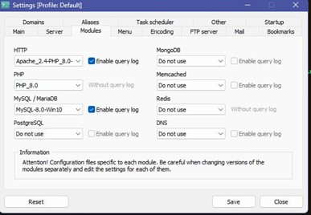
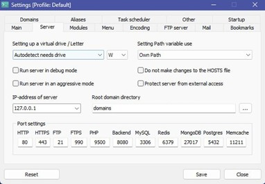
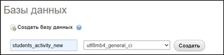
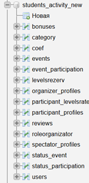
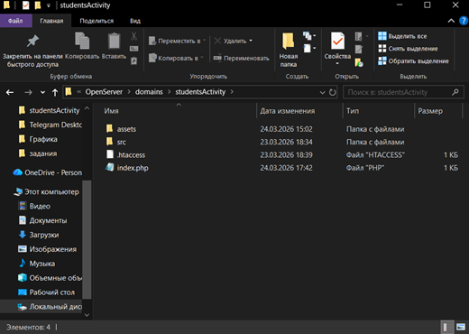

# students_activity
# README.md

## Документация к платформе "Движение молодежи"

### 1. Общая информация

**Название проекта:** Платформа "Движение молодежи"

**Тема:** Платформа рейтинга активности для молодежного парламента и кадрового резерва.

**Цель:** Создать веб-платформу для автоматизации учета активности участников, формирования прозрачного рейтинга и отбора кандидатов в кадровый резерв.

**Технологический стек:**
- Бэкенд: PHP (нативная разработка, без использования фреймворков).
- База данных: MySQL (MariaDB).
- Фронтенд: HTML5, CSS3, Bootstrap 5, JavaScript (Chart.js, html2canvas, jspdf).

---

### 2. Инструкция по развертыванию и установке

Для оценки работоспособности платформы необходимо выполнить следующие шаги:

**Установка веб-сервера и СУБД:**

Используйте OpenServer. Настройки Сервера и Модулей на рисунках 1,2.

  
*Рисунок 1 – Настройки Modules*

  
*Рисунок 2 – Настройки Server*

**Настройка базы данных:**

- Запустите OpenServer и откройте панель баз данных (Дополнительно – PhpMyAdmin).
- Войдите в учётную запись: Логин: root, без пароля.
- Создайте новую базу данных с именем "students_activity_new". В качестве кодировки укажите utf8mb4_general_ci (рисунок 3).

  
*Рисунок 3 – Создание БД*

- В меню импорта выберите файл из папки "database_file_sql" ("students_activity_new.sql"). Кодировка utf-8. Нажмите Вперёд. Вы увидите таблицы, рисунок 4.

  
*Рисунок 4 – Таблицы*

**Размещение кода проекта:**

- Разархивируйте все файлы проекта в папку OpenServer/domains/studentsactivity.
- Важно: убедитесь, что в вашей папке studentsactivity внутри будут файлы и папки проекта, как на рисунке 5, без промежуточных папок.

  
*Рисунок 5 – Папки проекта*

**Запуск приложения:**

- Нажмите иконку запущенного OpenServer (убедитесь, что флажок зелёный), далее Мои проекты – studentsactivity.
- Перед вами должна открыться главная страница платформы "Движение молодежи".

---

### 3. Инструкция по проверке функциональности

Для проверки всех ролей используйте предварительно созданные тестовые учетные записи. Добавление новых организаторов и наблюдателей производится только администратором базы данных (вручную через phpMyAdmin).

#### 3.1. Проверка роли "Участник"

**Тестовые данные для входа:**

Логин: memberPlatform  
Пароль: memb12321

**Алгоритм проверки:**

1. **Авторизация:** Нажмите кнопку "Войти" в правом верхнем углу. Введите логин и пароль.
2. **Страница "Мероприятия":**  
   - Перейдите в раздел "Мероприятия".  
   - Используйте фильтры (по статусу, категории, дате), чтобы убедиться в их работоспособности.  
   - Выберите любое мероприятие со статусом "Регистрация".
3. **Регистрация на мероприятие:**  
   - На странице мероприятия нажмите кнопку "Записаться на мероприятие".  
   - **Ожидаемый результат:** После нажатия появится сообщение об успешной регистрации, и статус изменится на "На рассмотрении". Это означает, что организатор еще не подтвердил ваше участие.
4. **Страница "Рейтинг":**  
   - Перейдите в раздел "Рейтинг".  
   - **Ожидаемый результат:** Отображается таблица "Топ-100 участников". Проверьте работу фильтра по категориям.
5. **Страница "Активность":**  
   - Перейдите в раздел "Активность".  
   - **Ожидаемый результат:** В левой колонке вы увидите "Ленту последних мероприятий". В правой колонке – "Облако тегов". В центре страницы должен отображаться "График активности", показывающий динамику начисления баллов для данного пользователя.

#### 3.2. Проверка роли "Наблюдатель"

**Тестовые данные для входа:**

Логин: spectratorPlatform  
Пароль: spect12321

**Алгоритм проверки:**

1. **Авторизация:** Войдите в систему под логином наблюдателя.
2. **Панель "Инспекция":**  
   - В верхнем меню должна появиться новая кнопка "Инспекция". Перейдите по ней. Это и есть страница кадрового резерва.
3. **Функции страницы "Инспекция":**  
   - **Фильтрация:** Используйте фильтры (возраст, город, количество мероприятий, средний балл) и нажмите "Применить". Список участников должен обновиться.  
   - **Скачивание отчета:** Найдите любого участника в списке и нажмите кнопку "Скачать PDF".  
   - **Ожидаемый результат:** Браузер должен автоматически скачать PDF-файл с отчетом по выбранному кандидату.

#### 3.3. Проверка роли "Организатор"

**Тестовые данные для входа:**

Логин: organisatorPlatform  
Пароль: org12321

**Алгоритм проверки:**

1. **Авторизация:** Войдите в систему под логином организатора.
2. **Панель "Администратора":**  
   - В верхнем меню должна появиться новая кнопка "Панель администратора". Перейдите по ней.
3. **Создание нового мероприятия:**  
   - В левой колонке на странице администратора найдите форму "Создание мероприятия".  
   - Заполните все поля: название, описание, даты. Обратите внимание на поле "Статус мероприятия".  
   - Выберите статус "Регистрация", чтобы участники могли на него записаться.  
   - Нажмите кнопку "Создать мероприятие".  
   - **Ожидаемый результат:** Сообщение об успешном создании.
4. **Управление созданным мероприятием:**  
   - Перейдите в раздел "Мероприятия", найдите созданное вами мероприятие и нажмите на него.  
   - На странице мероприятия нажмите кнопку "Управление мероприятием".
5. **Подтверждение участников и начисление баллов:**  
   - В разделе "Участники мероприятия" вы увидите пользователей, которые записались.  
   - Напротив участника выберите статус "Подтверждено" в выпадающем списке и нажмите "Обновить". (Пока статус мероприятия не изменен, баллы еще не начислены).  
   - Вернитесь в форму "Редактирование мероприятия" и измените его "Статус мероприятия" на "Завершено". Нажмите "Сохранить изменения".  
   - **Ожидаемый результат:** Появится сообщение: "Мероприятие обновлено. Баллы начислены участникам." Теперь у всех участников со статусом "Подтверждено" баллы за это мероприятие добавятся в общий рейтинг.

#### 3.4. Проверка дополнительных функций

**Профиль организатора:**

- Перейдите по ссылке на имя организатора из навигационного меню или из карточки любого его мероприятия.  
- **Ожидаемый результат:** В профиле отображается "Количество проведенных мероприятий", "Рейтинг доверия" и "Часто дарит призы".

**Отзыв об организаторе:**

- Войдите под учетной записью участника (memberPlatform).  
- Перейдите в профиль организатора.  
- **Ожидаемый результат:** В нижней части профиля организатора будет форма для отзыва с оценкой и комментарием. Оставьте отзыв. После этого рейтинг доверия организатора должен измениться.

---

*© 2026 Платформа "Движение молодежи"*
